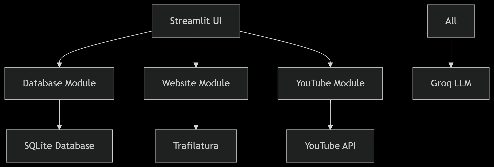

# Multi-Feature AI Assistant 🤖



A comprehensive Streamlit application combining three powerful AI-driven tools:
1. **Natural Language to SQL Generator** 🔍
2. **Website Content Analyzer** 🌐
3. **YouTube Video Summarizer** ▶️

## Features ✨

### 1. Database Query Generator (CSV/Excel to SQL) 💾
- **Simple File Upload**: Drag & drop CSV/Excel files
- **Automatic Database Creation**: Instantly creates SQLite database
- **AI-Powered SQL Generation**: Converts English questions to SQL queries
- **Smart Schema Detection**: Shows table structures & sample data
- **Instant Results**: Executes queries and displays results in tables

### 2. Website Question Answering 🌐
- **Content Extraction**: Pulls text from any webpage
- **Instant Q&A**: Ask questions about website content
- **AI Analysis**: Provides contextual answers from extracted text
- **Research Helper**: Perfect for quick information lookup

### 3. YouTube Video Summarizer ▶️
- **Auto Transcript**: Fetches video captions automatically
- **Bullet Point Summary**: Creates concise video overview
- **Key Points Extraction**: Highlights main ideas and takeaways
- **Time Saver**: Understand long videos in seconds

## 🚀 Quick Start Guide

### Prerequisites
- Python 3.8+
- [Groq API key](https://console.groq.com/)

### Installation
```bash
# Clone repository
git clone https://github.com/fahimai001/Chat_with_Data_GROQ_API
cd ai-assistant

# Create virtual environment
python -m venv venv
source venv/bin/activate  # Linux/Mac
venv\Scripts\activate  # Windows

# Install dependencies
pip install -r requirements.txt

# Create .env file
echo "GROQ_API_KEY=your_key_here" > .env